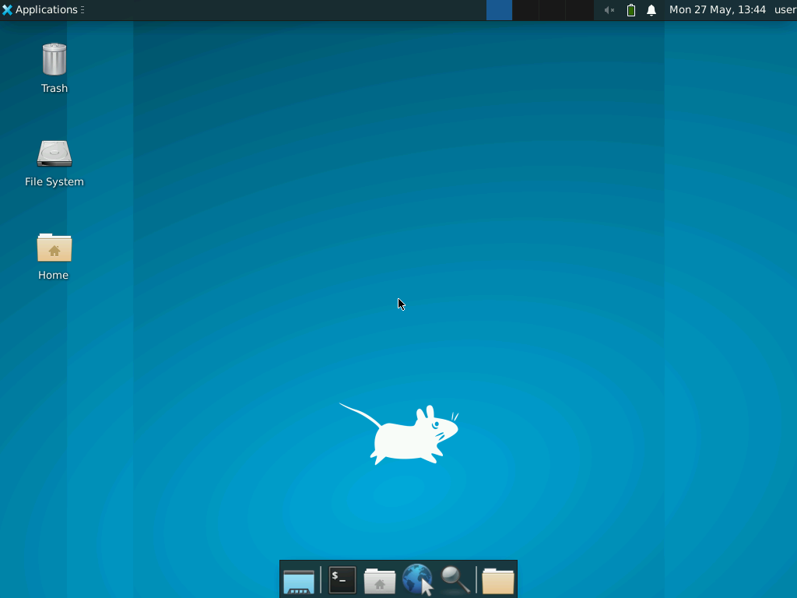
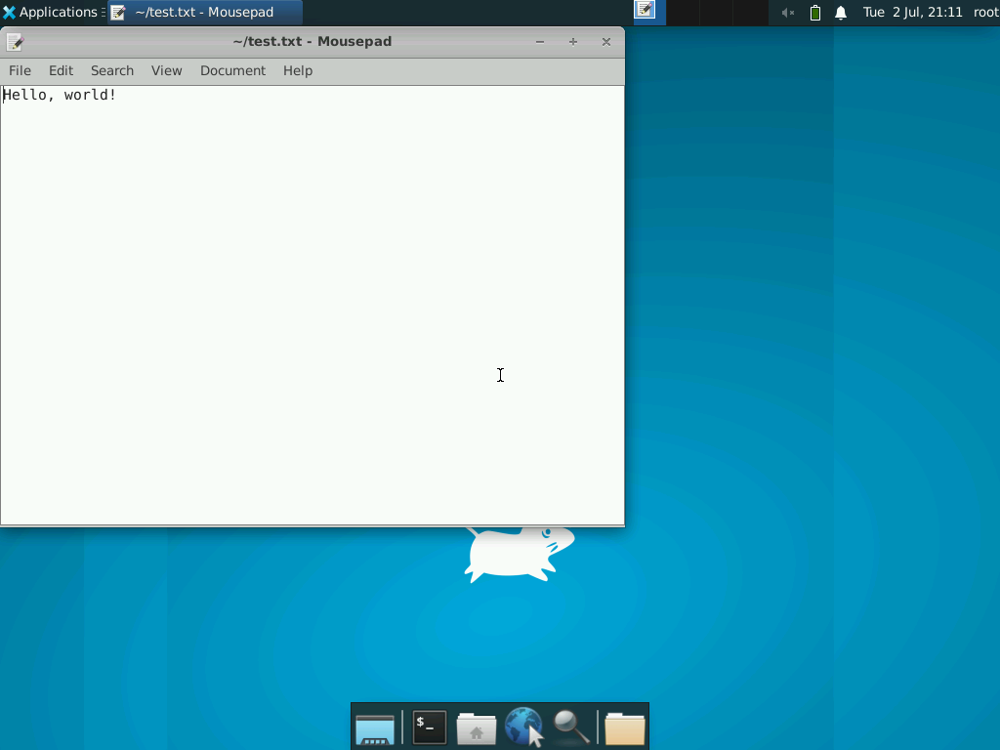

# E2B Desktop Environment

This repo shows how to run [E2B's sandboxes](https://e2b.dev/docs/sandbox/overview) with a graphical desktop-like environment. The desktop-like environment allows you to start applications like file explorers, browsers, terminals, notes, etc.

You can use PyAutoGUI to control the environment programmatically.

The desktop-like environment is based on Linux and [Xfce](https://www.xfce.org/) at the moment. We chose Xfce because it's a fast and lightweight environment that's also widely popular. Let us know if you need something else or if Xfce doesn't work for you.

## Example

The [example script](python/example.py) in this repo does the following and takes a screenshot after each action:

**1. Start the sandbox with a desktop environment**

Spawn a new sandbox and take a screenshot.

[Related code](https://github.com/e2b-dev/desktop/blob/main/python/example.py#L11-L12)




---

**2. Open the text editor**

Create a new file, write to the file, and open the file using Xfce's text editor called [Mousepad](https://docs.xfce.org/apps/mousepad/start).

[Related code](https://github.com/e2b-dev/desktop/blob/main/python/example.py#L14-L33)



---

**3. Use PyAutoGUI**

Use PyAutoGUI to write new text in the text editor.

[Related code](https://github.com/e2b-dev/desktop/blob/main/python/example.py#L35-L41)


## Caveats

#### Use `desktop_sandbox.screenshtot()` instead of `pyautogui.screenshot()`
The official PythonAutoGUI's screenshot method doesn't capture the mouse pointer. If you want to take a screenshot with the mouse pointer, use our implementation.
```py
from e2b_desktop import Desktop
desktop_sandbox = Desktop()
desktop_sandbox.screenshot("screenshot-name.png")
desktop_sandbox.close()
```

## How to run the example

**1. Install dependencies**

```bash
cd python && poetry install
```

**2. Add your `E2B_API_KEY=` to the `python/.env` file**
Get your E2B API key [here](https://e2b.dev/docs/getting-started/api-key).

Visit [E2B's docs](https://e2b.dev/docs/getting-started/api-key) to get your API key.

**3. (Optional) Modify the script**

Modify the [`python/example.py`](python/example.py) file to do what you want — for example, to move the mouse to the coordinates (100, 150), you can add the following line to the `desktop.pyautogui(<code>)` call:

```python
pyautogui.moveTo(100, 150)
```

> Running `desktop.pyautogui(<code>)` multiple times is fine.

> You can use all the methods from the [E2B SDK](https://e2b.dev/docs/sandbox/overview) to interact with the desktop.

**4. Run the script**

```bash
poetry run python example.py
```

**5. Inspect the screenshots**

After the script is finished, inspect the screenshots by checking them in the `python/` directory.

**6. (Optional) Modify the template**

If you want to preinstall dependencies you can modify the desktop template by editing the `template/*` files and then creating a [custom template](https://e2b.dev/docs/guide/custom-sandbox).

To spawn your custom sandbox, you need to pass the template name or ID to the constructor
```python
from e2b_desktop import Desktop

template_name_or_id = "my-sandbox-template"
desktop_sandbox = Desktop(template_name_or_id)
# ... perform actions in the sandbox
desktop_sandbox.close()
```
